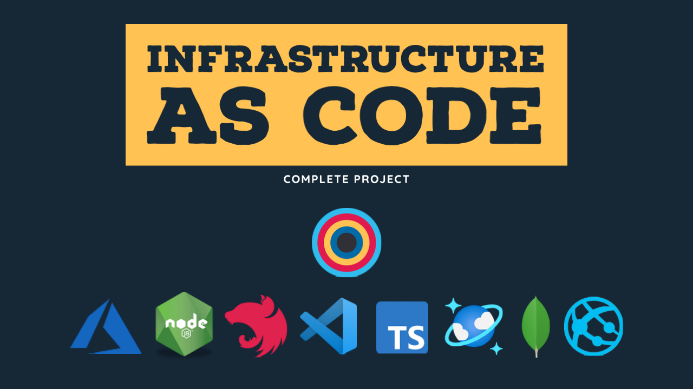
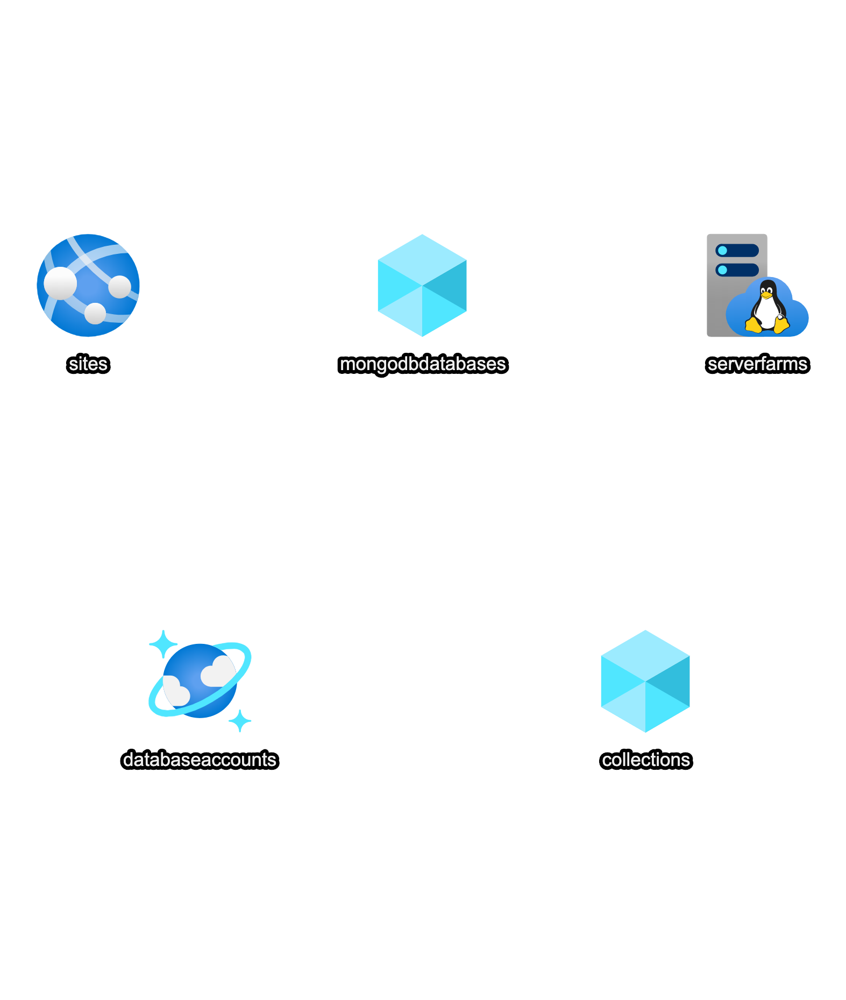

# Infrastructure as Code - Blogs Microservice

YouTube Link - https://youtu.be/OMR2-GC97gw

This project shows how to use infrastructure as code to create the infrastructure for a blogs microservice application. It has a corresponding video on [YouTube](https://youtu.be/OMR2-GC97gw) where you can learn:

1. How to apply IaC using Azure Resource Manager (ARM) templates and PowerShell.
2. How to support multiple environments.
3. How to store configurations in environment variables.
4. How to setup a proper solution structure.
5. How to create a blogs microservice using Nodejs, Nestjs, TypeScript and Mongodb.
6. How to connect the app to Azure Cosmos db.
7. How to use VS Code extensions to explore Azure resources.
8. How to deploy a Nodejs app to Azure.

## Tech Stack

1. [Azure](https://azure.microsoft.com/en-us/free/)
2. [ARM Templates](https://docs.microsoft.com/en-us/azure/azure-resource-manager/templates/overview)
3. [Mongodb](https://www.mongodb.com/2)
4. [Nodejs](https://nodejs.org/en/)
5. [Nestjs](https://nestjs.com/)
6. [TypeScript](https://www.typescriptlang.org/)
7. [Cosmos db](https://docs.microsoft.com/en-us/azure/cosmos-db/introduction)
8. [VS Code](https://code.visualstudio.com/)

## Resources

1. [IaC](https://docs.microsoft.com/en-us/azure/devops/learn/what-is-infrastructure-as-code)
2. [ARM Template Documentation](https://docs.microsoft.com/en-us/azure/azure-resource-manager/templates/)

## Prerequisites:

You need to have the following installed on your machine to follow along with the project:

1. [Node](https://nodejs.org/en/)
2. [VS Code](https://code.visualstudio.com/)

You will also need an Azure account:

1. [Azure](https://azure.microsoft.com/en-us/free/)

## Extensions

- [Azure Databases](https://marketplace.visualstudio.com/items?itemName=ms-azuretools.vscode-cosmosdb)
- [Azure App Service](https://marketplace.visualstudio.com/items?itemName=ms-azuretools.vscode-azureappservice)
- [Azure Resource Groups](https://marketplace.visualstudio.com/items?itemName=msazurermtools.azurerm-vscode-tools)
- [Azure Resource Manager Tools](https://marketplace.visualstudio.com/items?itemName=ms-azuretools.vscode-azureresourcegroups)

# IaC - ARM & PowerShell

Infrastructure as Code (IaC) is the management of infrastructure in a descriptive model, using the same versioning as DevOps team uses for source code. Like the principle that the same source code generates the same binary, an IaC model generates the same environment every time it is applied.

The following Azure resources will be created for the blog microservice application:

1. Cosmos Db Account
2. Mongo Db
3. Mongo Collection
4. App Service Plan
5. App Service

## Powershell on Mac

- `brew install --cask powershell`
- `pwsh`

# Blogs Microservice - Node.js, Nestjs & MongoDb

## Design

| HTTP Verb | API                | Description             | Request Body | Response Body  |
| --------- | :----------------- | :---------------------- | :----------- | :------------- |
| GET       | /api/v1/blogs      | Get all blogs           | None         | Array of Blogs |
| GET       | /api/v1/blogs/{id} | Get a blog by id        | None         | Blog           |
| POST      | /api/v1/blogs      | Add a new blog          | Blog         | Blog           |
| PUT       | /api/v1/blogs/{id} | Update an existing blog | Blog         | None           |
| DELETE    | /api/v1/blogs/{id} | Delete a blog           | None         | None           |

## Creating a new project

- `npm i -g @nestjs/cli`
- `nest new blogs-api`
- `cd blogs-api`
- `npm run start`
- `curl http://localhost:3000/`

## Packages
- `npm install dotenv  --save`
- `npm install @types/dotenv --save-dev`
- `npm i mongoose@5.10.3  --save`
- `npm install @types/mongoose --save-dev`

## Blog Module

- Mongoose Schema
- Repository
- Models & Service
- Controller

## Swagger

- `npm install --save @nestjs/swagger swagger-ui-express`

YouTube Link - https://youtu.be/OMR2-GC97gw
